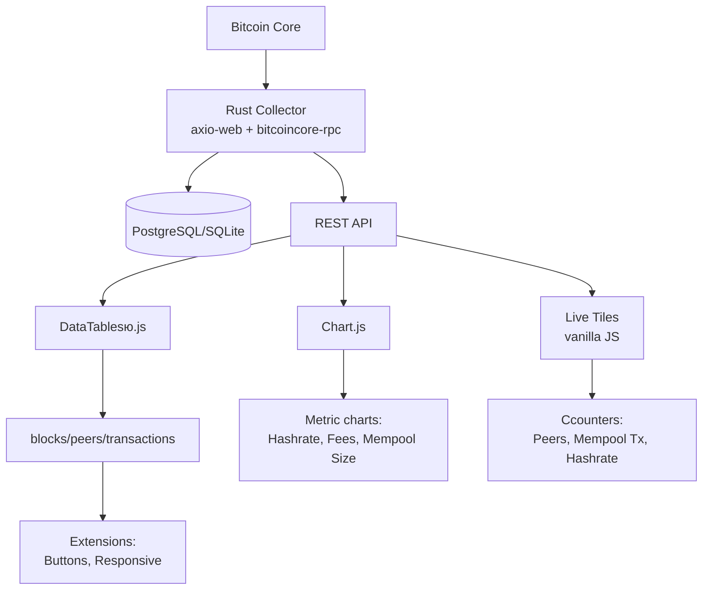

```mermaid
flowchart TD
A[Bitcoin Core] --> B[Rust Collector<br/>axio-web + bitcoincore-rpc]
B --> C[(PostgreSQL/SQLite)]
B --> D[REST API]

    D --> E[DataTablesю.js]
    D --> F[Chart.js]
    D --> G[Live Tiles<br/>vanilla JS]
    
    E --> H[blocks/peers/transactions]
    F --> I[Metric charts:<br/>Hashrate, Fees, Mempool Size]
    G --> J[Сcounters:<br/>Peers, Mempool Tx, Hashrate]
    
    H --> K[Extensions:<br/>Buttons, Responsive]
```